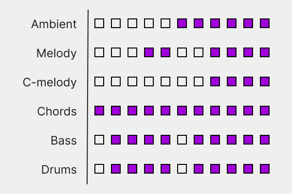

# How Songs are Generated
Deeper dive into the music generating process.

*See [Backend Architecture](/docs/03_architecture/00_architecture.md) to view the highest level explanation.*

Each song is generated through this process:

1. **SongElements** - [RNG Song Elements](#rng-song-elements)
    - `key`
    - `time`
    - `bpm`
    - `prog`
1. **MidiGen** - [Generate MIDI Loop Files](#generate-midi-loop-files)
    1. [Generate chords using `key` and `prog`](#generate-chords-using-key-and-prog)
        - `chords_mid`
    1. [Use chords to make melodic/harmonic parts](#use-chords-to-make-melodicharmonic-parts)
        - `ambient_mid`
        - `melody_mid`
        - `cmelody_mid`
        - `bass_mid`
1. **LoopGen** - [Generate Audio Loop Files](#generate-audio-loop-files)
    1. [RNG Sf2 Instruments](#rng-sf2-instruments)
        - `ambient_name`
        - `melody_name`
        - `cmelody_name`
        - `chords_name`
        - `bass_name`
    1.  [Produce Audio Loops from Sf2 Name and MIDI Loop](#produce-audio-loops-from-sf2-name-and-midi-loop)
        - `ambient_loop`
        - `melody_loop`
        - `cmelody_loop`
        - `chords_loop`
        - `bass_loop`
    1. [RNG Drum Kit Samples](#rng-drum-kit-samples)
        - `kick_name`
        - `hat_name`
        - `snare_name`
    1. [Produce Drum Loop from Samples and bpm](#produce-drum-loop-from-samples-and-bpm)
        - `drum_loop`
1. **SegmentGen** - [Generate Song Segments](#generate-song-segments)
    1. [RNG Song Structure](#rng-song-structure)
        - `song_structure`
    1. [Produce Segments from Loop and Song Structure](#produce-segments-from-loop-and-song-structure)
        - `ambient_segment`
        - `melody_segment`
        - `cmelody_segment`
        - `chords_segment`
        - `bass_segment`
        - `drum_segment`
1. **Combine** - [Combine segments into final song audio](#combine-segments-into-final-song-audio)
    - `song_path`

## RNG Song Elements
Use simple RNG to create values for these base song elements:
- `key` - The key/tonic/root scale degree of the song
- `time` - The time signature of the song
- `bpm` - The beats per minute of the song
- `prog` - The meta-implementation of a chord progression
    - `prog` is different than chords in that chords are the notes together and prog is the relationship/distances of the notes
        - ***bV7** is a prog but **G♭7*** is a chord

## Generate MIDI Loop Files
### Generate chords using `key` and `prog`
The `prog`'s are written in Roman numeric notation, functionally between "I" and "VII" including the accidental and chord type. This allows the progressions to be transposed into any key that's RNG'd.

The chords are the `prog` once given a `key`. The `prog` item **bV7** becomes **G♭7** once the key of **C** is expressed. Both `key` and `prog` are initialized in the [*SongElements*](#rng-song-elements) step. Using this information, combined with the bpm and time signature, we create the chords of the song.

The `prog` is randomly chosen from a hard-coded list.

### Example
Given the key is *C*, and the notation is "bVI7", here's how we'd find the chord in terms of the key:
 - (*VI*) - **VI** is Roman numeral for 6, so we'd base the root of our chord on the 6th scale degree of *C*, which is `A`.
 - (*b*) - **b** is an alpha representation of the flat symbol, ♭. This means the scale is lowered by half a step, so *A* is lowered into `A♭`
 - (*VI* is uppercase) - Uppercase means that the chord is major, and lowercase *vi* means the chord is minor. So we have an `A♭ major` chord
 - (*7*) - 7 directly after the chord here will mean the chord is a dominant chord (major chord with a ♭7). So we have an `A♭ Dominant 7th`

Key=*C* + Chord=*bVI7* = Chord is `A♭7`

> A♭7 chord on piano

There's a collection of suitable chord progressions that are hard-coded into the program. This will make the generation process much easier than programming even more theory to build chord progressions from sctratch. Using **root position** only -- again, for simplicity. 

> Root position vs. 1st & 2nd inversion

The RNG chooses which chord progression to use for the song and the chords will be built based on the song's key.

### Use chords to make melodic/harmonic parts
The chords can also give the information on what the notes are in that chord's scale. Those notes can be used to generate melodic ideas. These midi files are randomly generated melodic ideas, in order of increasing complexity:
- `bass_mid`
- `ambient_mid`
- `cmelody_mid`
- `melody_mid`

These MIDI files are the size of a single loop - a duration of a whole chord progression (typically 4 measures for 4-chord progressions).

## Generate Audio Loop Files
### RNG Sf2 Instruments
The SoundFonts are used in different places depending on the purpose of the instruments. This is chosen on taste; some instruments sound better for melodic ideas, some for chords, etc.

Each of these SoundFonts will be placed in specific folders for the part of the song it's used for. That'll make the RNG easier and less likely to cause problems.

### Produce Audio Loops from Sf2 Name and MIDI Loop
sf2_loader and the SoundFonts are used with the MIDI loop to create an audio of the MIDI loop involved.

We're exporting the loops at this stage instead of later so that the storage usage will be optimized. We can loop later without further exporting and create the final song from that. See [*Generate Segments*]() for more information.

### RNG Drum Kit Samples
The drums are used via sampling one-shots from live drum kits. This will not need a MIDI conversion step since no Soundfonts will be used. 

### Produce Drum Loop from Samples and BPM
We'll use AudioSegments here to create a quasi-drum machine from the samples. AudioSegments will also allow exporting audio files similar to the [MIDI -> Audio](#produce-audio-loops-from-sf2-name-and-midi-loop) step above.

## Generate Song Segments
In this program, segments are the simple instrument part for the duration of the whole song. A song structure is used to template when & when not to play a certain high-level element in the song. High-level elements are the ambient/melody/countermelody/chords/bass/drum parts that make the song.
### RNG Song Structure
The song structure here is abstracted as a pattern of high-level elements.
These high-level elements will be taken in and out of the song to give the song a sense of direction.

#### Example
Here's a visual of how the song structure will work:

> Structure of lo-fi song, [*The Far Side*](https://www.youtube.com/watch?v=xocnshwEbrM&t=0s) by Comus

Each square represents the duration of a sigle chord progression ("loop"). The parts that are filled in are the actively played elements during that point in the song; empty squares are silent. This will be the basis of how the songs will work from beginning to end.

The structures are hard-coded because there's not much variety in lo-fi hip-hop, and people are probably not going to notice the difference anyway.

### Produce Segments from Loop and Song Structure
Once the abstracted high-level elements loops are made and the structure is chosen, then we use AudioSegment to repeat each loop, on and off, for the duration of the song. *On* will indicate that the high-level loop will play and *off* will indicate a silence for the duration of the loop. These will be saved as a segment, or AudioSegment type. We combine this in the next step and won't need to export each high-level element into an audio file, saving storage space.

## Combine segments into final song audio
Segments are combined and exported into a final song audio, ready to stream on the frontend UI.
