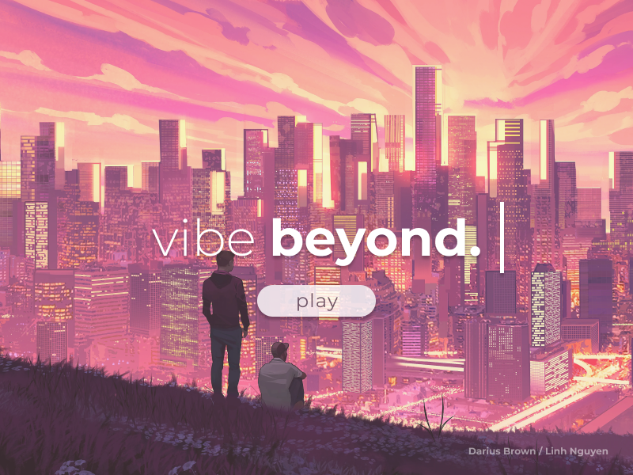
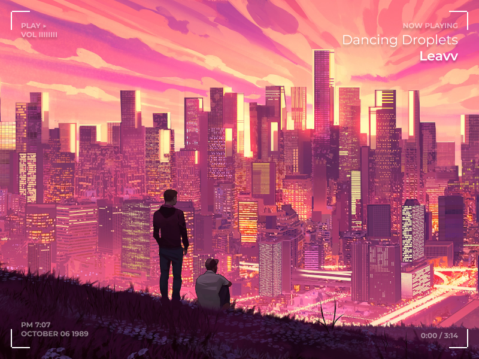
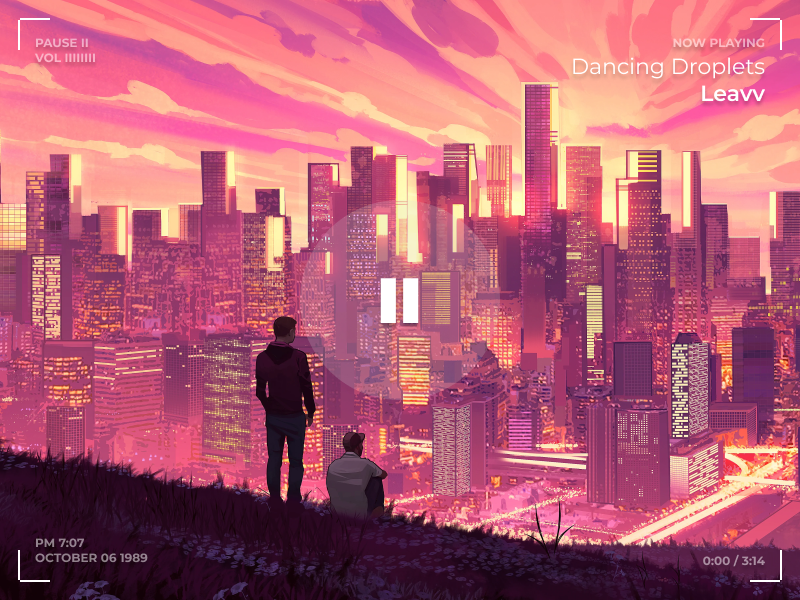
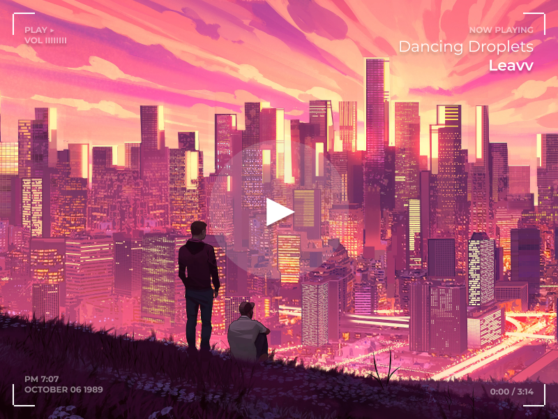
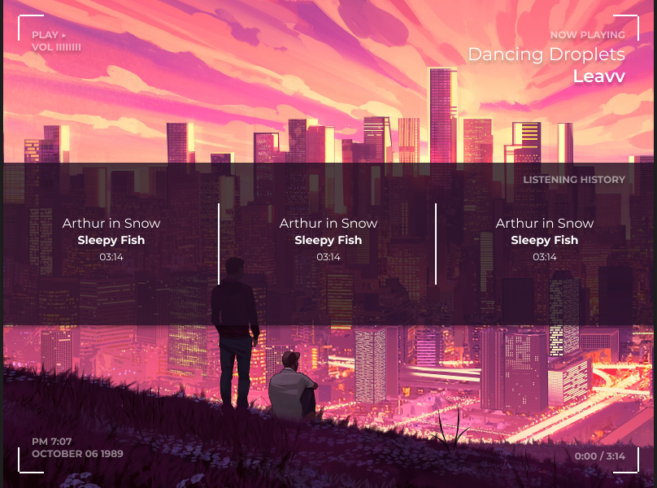

# Frontend

Here are some images from Figma illustrating the different screens used in the application. Figma file can be found here: [Vibe Beyond Wireframe](https://www.figma.com/file/66tZ8kdzd7ltYovCvs25tl/Vibe-Beyond-wireframe?t=qoi9xIYPsI596K1e-6).

## Start Screen

* No opening transition. Start with this background and button already visible.
* The text "vibe beyond" should have the text appear as if it is being typed in. 
    * Optional: The vertical bar to the right would blink after as if it were an editor cursor.

## Playing Screen

* Transition from Start Screen by:
    * Fading whole screen to white (quickly), starting the music, and fading into playing screen (with white corners already included).
* Have all text on the screen appear through the typing animation from before

## Play to Pause Screen

* Splash the screen and show the pause character (2 uppercase letter I's in Montserrat) in the center of the screen

## Pause to Play

* Same as above

## Toggle History

* Animate purple banner by flying in from the right to the left. Fade in and slightly fly down each text box/vertical bar in the banner.